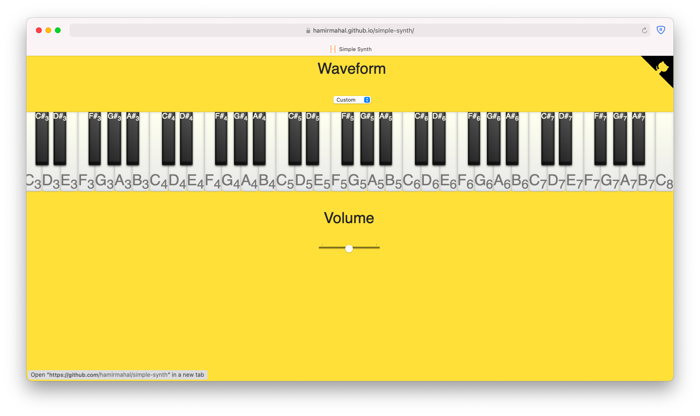
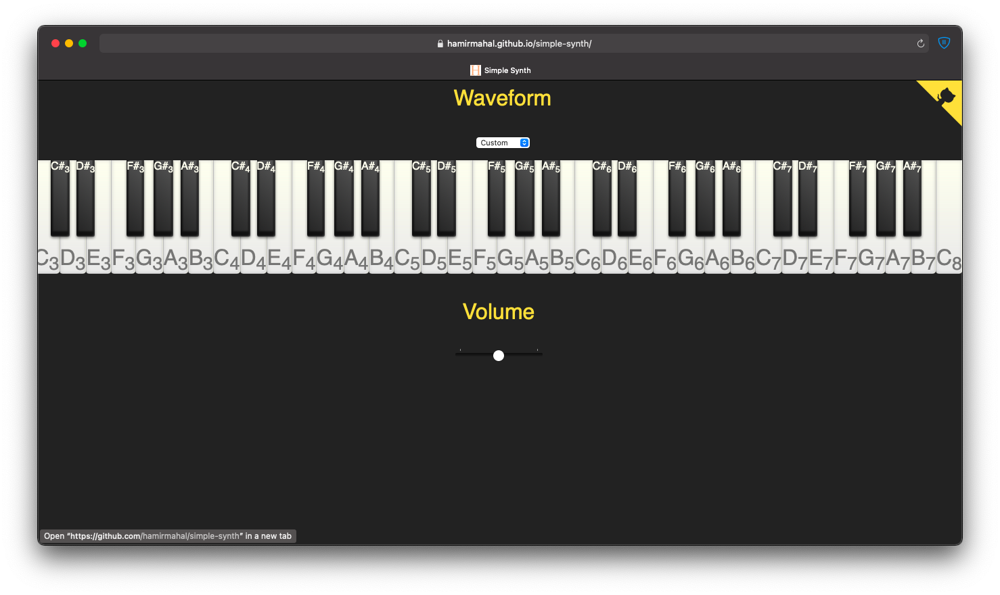

This is a simple synthesizer I built that uses the steps in an [MDN tutorial on building a simple synthesizer](https://developer.mozilla.org/en-US/docs/Web/API/Web_Audio_API/Simple_synth) as its foundation.

It also heavily uses styling from a very aesthetic [CSS Piano](https://codepen.io/zastrow/pen/oDBki).

You can view a live demonstration of this repository at [https://hamirmahal.github.io/simple-synth/](https://hamirmahal.github.io/simple-synth/).

This is what the keyboard looks like with a day theme active.

And, this is what it looks like with a night theme active.

